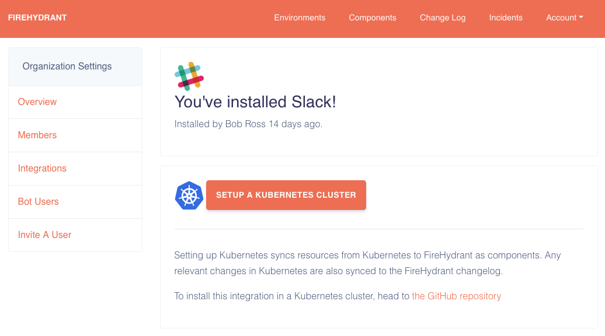
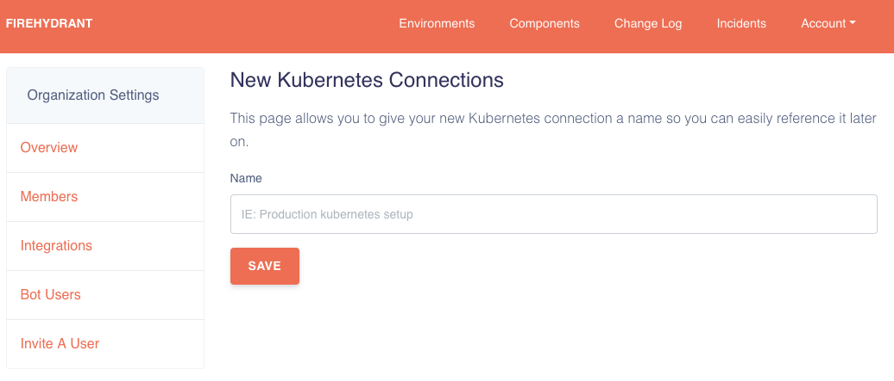
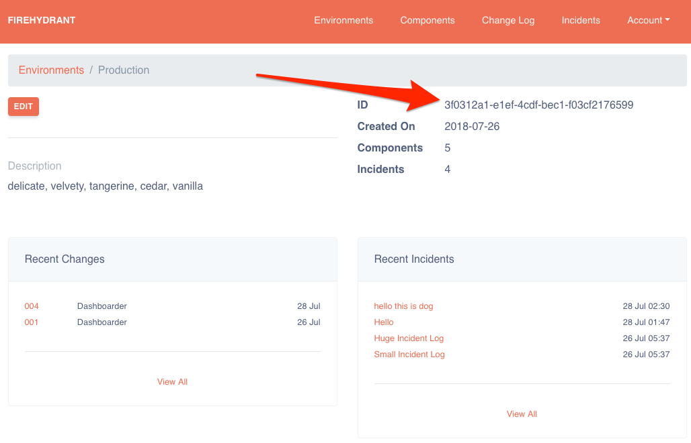
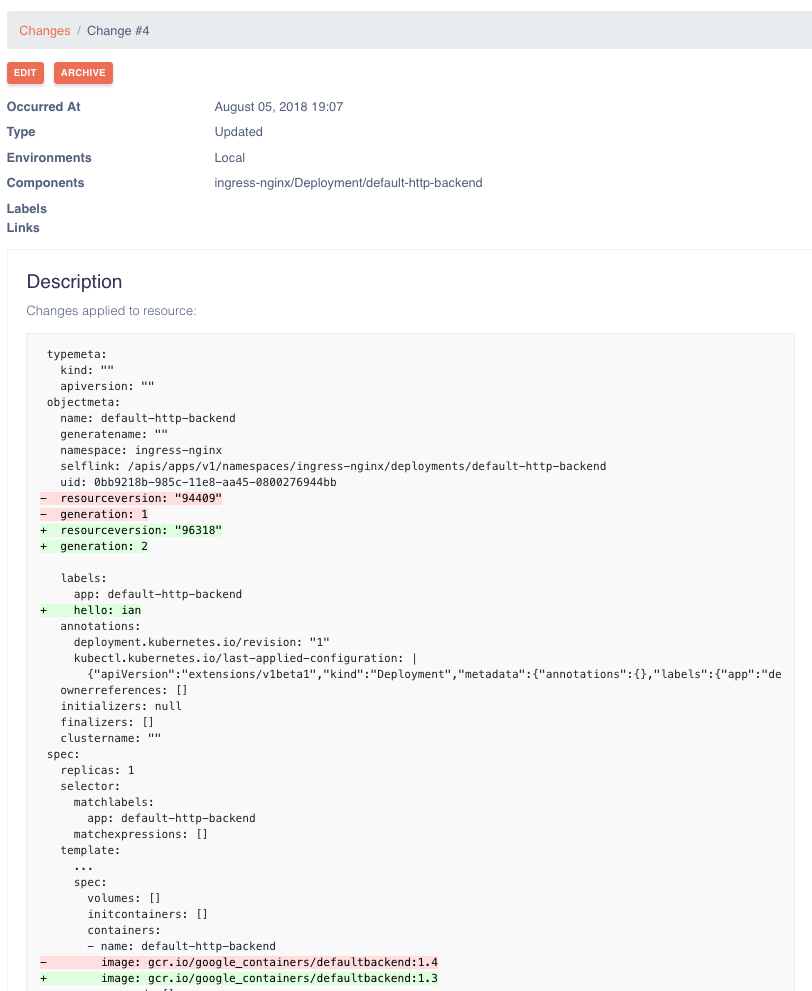

# FireHydrant Kubernetes Service Catalog

This project installs a helm chart that watches Kubernetes resources and sends them to the Service Catalog and Changelog features of [FireHydrant.io](https://firehydrant.io). It allows you to separate namespaces into environments, sync workloads to FireHydrant as components, and keep track of creates, updates, and deletions of Kubernetes resources automatically.

## What does it do?

This project syncs your Kubernetes resources to your FireHydrant account as components. After that, it will automatically sync all creates / updates / deletes as Changelog entries to FireHydrant as well. It aims to transparently keep track of high level changes of your environment and give a running log of what changed and when.

After this installed and churning along on your Kubernetes cluster, you'll start seeing changelog entries for:

* ReplicaSets
* Deployments
* StatefulSets
* DaemonSets
* Services

These resources will also be created in your FireHydrant organiation if they don't already exist with the proper labels.

## Obtaining A Kubernetes Token

To install the k8s-service-catalog watcher, you need to generate this token on your [FireHydrant](https://firehydrant.io) account.

Once logged in, travel to the https://firehydrant.io/organizations/integrations page. On here you'll see a "Setup A Kubernetes Cluster".



From here, you'l need to create a token. Click the "New Connection" link and enter in a name for the cluster token identifier.



### Selecting Environments

After you've created this token you need to map the environments in your FireHydrant account to Kubernetes namespaces. The `*` namespace identifier will map all namespaces to a single environment in FireHydrant as well.

On the Environment page, you can see your environment's ID:



You can then use this ID in your configuration file to specify how namespaces in your cluster (or all of them) map to FireHydrant.

The `k8s-service-catalog` project automatically looks for a configuration file at `/etc/k8s-watcher/config.yml`.

## Configuration

`k8s-service-catalog` relies on YAML configuration (by default it looks for it at `/etc/k8s-watcher/config.yml`). The configuration defines how the watcher should be sent events and environments.

A basic configuration looks like, given we have a "Production" environment setup:

```yaml
apiToken: "fhi-firehydrant-token"

watch:
  - namespace: "*"            # watch all namespaces
    environment: "5afe77ff-67f3-4114-98d9-40026377b6a8" # UUID of the Environment in your account
```

This informs the watcher to send all updates for all namespaces for the "Production" (Name for the given ID) environment.

### Environment Variables

The configuration file allows for environment variable substitution using the `$VAR` or `${VAR}` format. This is helpful if you want to use environment variables to configure something such as the `apiToken` field.

```yaml
apiToken: "${FIREHYDRANT_TOKEN}"
```

Your API token is the one you created on the Kubernetes integration page on FireHydrant.io.

## Installation With Helm

Installation via Helm is the preferred way of deploying this project, you can install it here: https://helm.sh/

This repository comes with a Helm chart to allow installing it easily into a Kubernetes cluster. To get started, you can clone this repository to your local machine and use `helm install`. Follow these steps:

```
$ git clone https://github.com/firehydrant-io/k8s-service-catalog.git
$ cd k8s-service-catalog
```

There's a folder containing the helm chart in this repository at [install/helm](install/helm). There's a few variables we can set when installing this Helm chart:

```
# install/helm/values.yaml
imageTag: firehydrantio/k8s-changelog:0.1.0
apiKey: ""
environments: {}
```

The `environments` object is where you can map environments to namespaces in Kubernetes. As an example, here's a sample Helm install setting all namespaces to point to our production environment by its ID:

```
$ helm install \
  --name=firehydrant \
  --set apiKey=fhb-4368a18809cc7313d1db8772224fb5df \
  --set "environments.*=598c0a42-36ef-4cd0-ae7f-0fb60d366fee" \
  install/helm
```

This will create a namespace called `firehydrant-system` that deploys a single pod that watches deployments in the configured namespaces in your Kubernetes environment. If you'd like to see what is going to be installed, replace `helm install` with `helm template`.

#### Multiple Environments

There may be times where you want to install FireHydrant watcher for multiple namespaces. You can use the `--set` option of helm to accomplish this as well:

```
$ helm install \
  --name=firehydrant \
  --set apiKey=fhb-4368a18809cc7313d1db8772224fb5df \
  --set "environments.applications=598c0a42-36ef-4cd0-ae7f-0fb60d366fee" \
  --set "environments.default=598c0a42-36ef-4cd0-ae7f-0fb60d366fee" \
  install/helm
```

### What now?

After this installed and churning along on your Kubernetes cluster, you'll start seeing changelog entries for:

* ReplicaSets
* Deployments
* StatefulSets
* DaemonSets
* Services

Changes a little like this in FireHydrant.io's UI:


